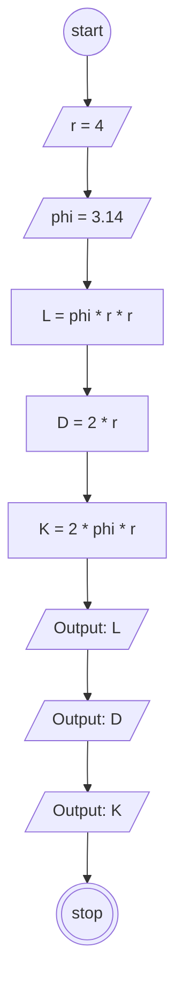

# Algoritma Javascript

## Task 1

1. Mulai
2. Tentukan nilai r atau jari-jari dengan angka 4
3. Tentukan nilai Phi dengan angka 3.14
4. Hitung luas lingkarang dengan cara 3.14 dikali 4 dikali 4
5. Hitung diameter lingkaran dengan cara 2 dikali 4
6. Hitung Keliling Lingkaran dengan cara 2 dikali 3.14 dikali 4 
7. Tampilkan luas lingkaran
8. Tampilkan diameter lingkaran
9. Tampilkan Keliling lingkaran
10. Stop

