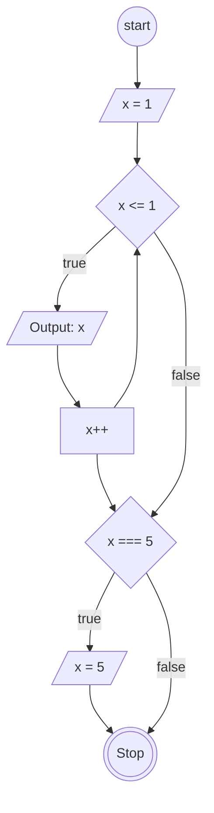

# Flowchart For

## For Loop

```mermaid
    flowchart TB
        Start@{ shape: circ, label: "start"}

        InitialVar@{ shape: lean-r, label: "x = 1"}
        Condition@{ shape: diamond, label: "x <= 1"}
        ConditionTrue@{ shape: rect, label: "x++"}

        ConditionTruePrint@{ shape: lean-r, label: "Output: x"}

        If@{ shape: diamond, label: "x === 5"}
        IfTrue@{ shape: lean-r, label: "x = 5"}


        Stop@{ shape: dbl-circ, label: "Stop"}

        Start-->InitialVar-->Condition-->|true|ConditionTruePrint-->ConditionTrue-->If-->|true|IfTrue-->Stop

        Condition-->|false|If
        ConditionTrue-->Condition

        If-->|false|Stop

```
