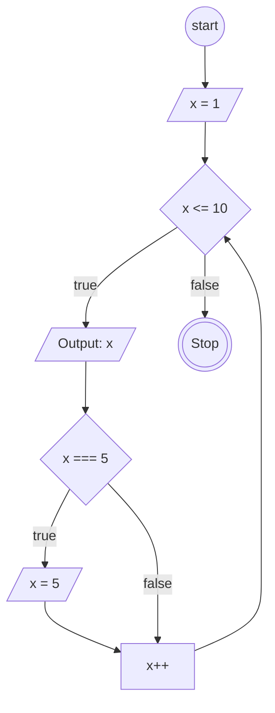
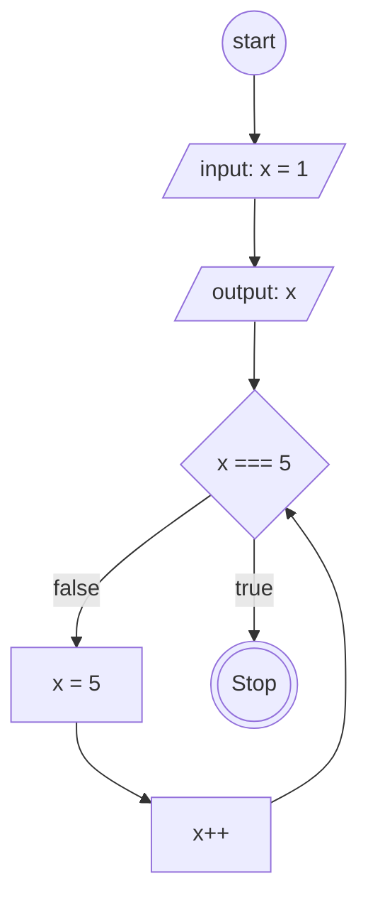

# Flowchart For

## For Loop


```mermaid
    flowchart TB
        Start@{ shape: circ, label: "start"}

        InitialVar@{ shape: lean-r, label: "x = 1"}
        Condition@{ shape: diamond, label: "x <= 10"}
        ConditionTrue@{ shape: rect, label: "x++"}

        ConditionTruePrint@{ shape: lean-r, label: "Output: x"}

        If@{ shape: diamond, label: "x === 5"}
        IfTrue@{ shape: lean-r, label: "x = 5"}


        Stop@{ shape: dbl-circ, label: "Stop"}

        Start-->InitialVar-->Condition-->|false|Stop

        Condition-->|true|ConditionTruePrint-->If-->|true|IfTrue-->ConditionTrue

        If-->|false|ConditionTrue-->Condition
```

## dowhile

```js
let x = 1
do {
    console.log(x)
    if (x === 5) {
        x = 10
    }
} while (x<=1);
```


```mermaid
    flowchart TB
        Start@{ shape: circ, label: "start"}
        InitialVar@{ shape: lean-r, label: "input: x = 1"}
        PrintX@{ shape: lean-r, label: "output: x"}

        If@{ shape: diamond, label: "x === 5"}
        IfTrue@{ shape: rect, label: "x = 5"}

        Condition@{ shape: rect, label: "x++"}

        Stop@{ shape: dbl-circ, label: "Stop"}

        Start-->InitialVar-->PrintX-->If-->|false|IfTrue-->Condition-->If

        If-->|true|Stop
```
