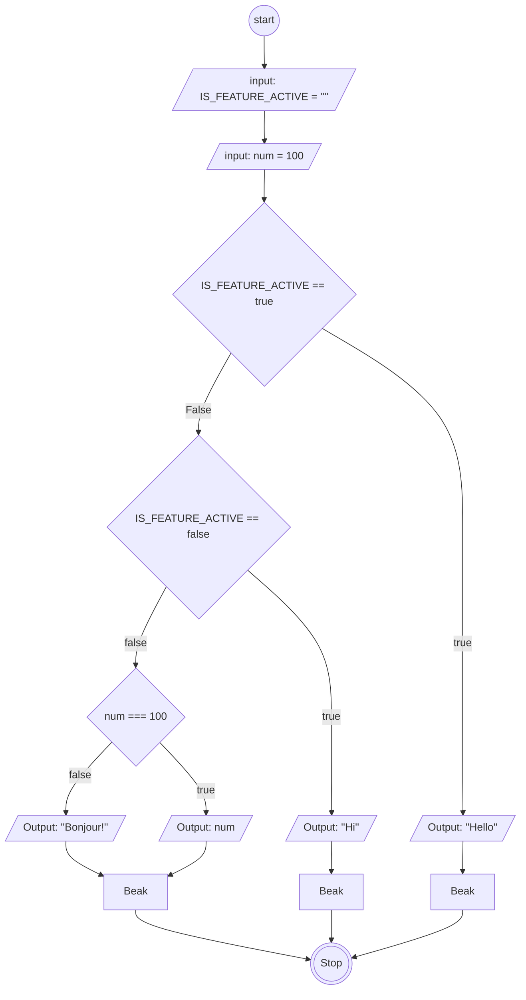

# Flowchart Switch Case

```mermaid
    flowchart TB
        Start@{ shape: circ, label: "start"}
        IS_FEATURE_ACTIVE@{ shape: lean-r, label: "input: IS_FEATURE_ACTIVE = ''''"}
        num@{ shape: lean-r, label: "input: num = 100"}

        CaseTrue@{ shape: diamond, label: "IS_FEATURE_ACTIVE == true"}
        OutputTrue@{ shape: lean-r, label: "Output: ''Hello''"}

        CaseFalse@{ shape: diamond, label: "IS_FEATURE_ACTIVE == false"}
        OutputFalse@{ shape: lean-r, label: "Output: ''Hi''"}

        Default@{ shape: diamond, label: "num === 100"}
        DefaultTrue@{ shape: lean-r, label: "Output: num"}
        DefaultFalse@{ shape: lean-r, label: "Output: ''Bonjour!''"}


        Break1@{ shape: rect, label: "Beak"}
        Break2@{ shape: rect, label: "Beak"}
        Break3@{ shape: rect, label: "Beak"}

        Stop@{ shape: dbl-circ, label: "Stop"}

    Start-->IS_FEATURE_ACTIVE-->num-->CaseTrue-->|False|CaseFalse-->|false|Default-->|false|DefaultFalse-->Break3-->Stop

    CaseTrue-->|true|OutputTrue-->Break1-->Stop
    CaseFalse-->|true|OutputFalse-->Break2-->Stop

    Default-->|true|DefaultTrue-->Break3
```
