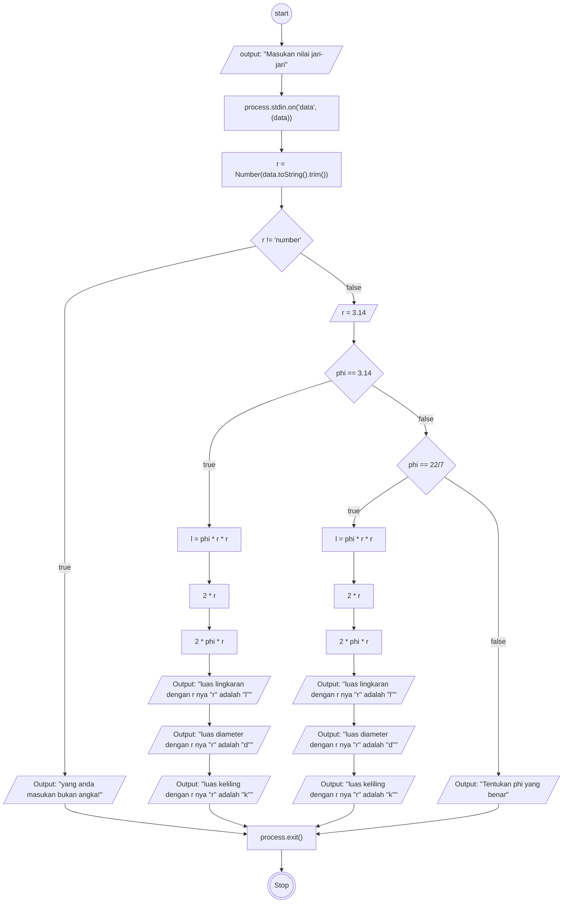

# Hitung Luas Keliling Lingkaran

```mermaid
    flowchart TB
        Start@{ shape: circ, label: "start"}
        Print@{ shape: lean-r, label: "output: ''Masukan nilai jari-jari''"}
        Data@{ shape: rect, label: "process.stdin.on('data', (data))"}
        r@{ shape: rect, label: "r = Number(data.toString().trim())"}
        NumberIs@{ shape: diamond, label: "r != 'number'"}
        PrintWrong@{ shape: lean-r, label: "Output: ''yang anda masukan bukan angka!''"}

        ProccessExit@{ shape: rect, label: "process.exit()"}

        phi@{ shape: lean-r, label: "r = 3.14"}

        phi314@{ shape: diamond, label: "phi == 3.14"}
        lPhi314@{ shape: rect, label: "l = phi * r * r"}
        dPhi314@{ shape: rect, label: "2 * r "}
        kPhi314@{ shape: rect, label: "2 * phi * r "}
        PrintLPhi314@{ shape: lean-r, label: "Output: ''luas lingkaran dengan r nya ''r'' adalah ''l''''"}
        PrintDPhi314@{ shape: lean-r, label: "Output: ''luas diameter dengan r nya ''r'' adalah ''d''''"}
        PrintKPhi314@{ shape: lean-r, label: "Output: ''luas keliling dengan r nya ''r'' adalah ''k''''"}

        phi22@{ shape: diamond, label: "phi == 22/7"}
        lPhi22@{ shape: rect, label: "l = phi * r * r"}
        dPhi22@{ shape: rect, label: "2 * r "}
        kPhi22@{ shape: rect, label: "2 * phi * r "}
        PrintLPhi22@{ shape: lean-r, label: "Output: ''luas lingkaran dengan r nya ''r'' adalah ''l''''"}
        PrintDPhi22@{ shape: lean-r, label: "Output: ''luas diameter dengan r nya ''r'' adalah ''d''''"}
        PrintKPhi22@{ shape: lean-r, label: "Output: ''luas keliling dengan r nya ''r'' adalah ''k''''"}

        notphi@{ shape: lean-r, label: "Output: ''Tentukan phi yang benar''"}

        Stop@{ shape: dbl-circ, label: "Stop"}

        Start --> Print --> Data --> r --> NumberIs --> |true| PrintWrong --> ProccessExit --> Stop

        NumberIs --> |false|phi --> phi314 --> |true| lPhi314 --> dPhi314 --> kPhi314 --> PrintLPhi314 --> PrintDPhi314 --> PrintKPhi314 --> ProccessExit

        phi314 --> |false| phi22 -->|true| lPhi22 --> dPhi22 --> kPhi22 --> PrintLPhi22 --> PrintDPhi22 --> PrintKPhi22 --> ProccessExit

        phi22-->|false|notphi-->ProccessExit

```
