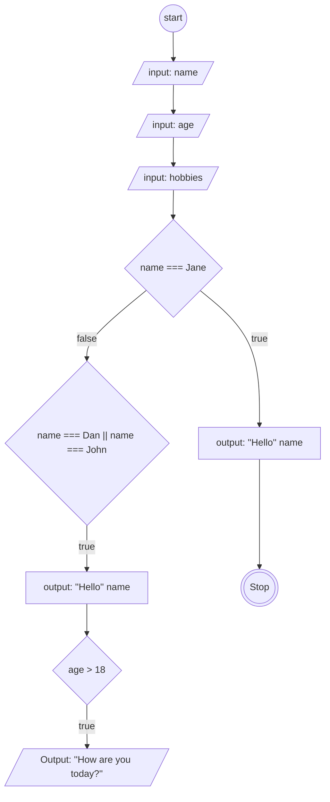

# Algoritma Javascript
```
let fullName = "John"
let age = 20
let hobbies = ["Programming"]

if(fullName === "Jane"){
    console.log(`Hello ${fullName}`)
}else if(fullName === "Dan" || fullName === "John"){
    console.log(`Whats'up ${fullName}`)
    if(age > 18){
        console.log("How are you today?")
    }else{
        console.log("Let's go to school!")
        if(hobbies[0] === "Programming"){
            console.log("I love JavaScript!")
        }
    }
}else if(fullName === "John"){
    console.log(`Hi ${fullName}`)
}else{
    console.log("Hola!")
}
```
